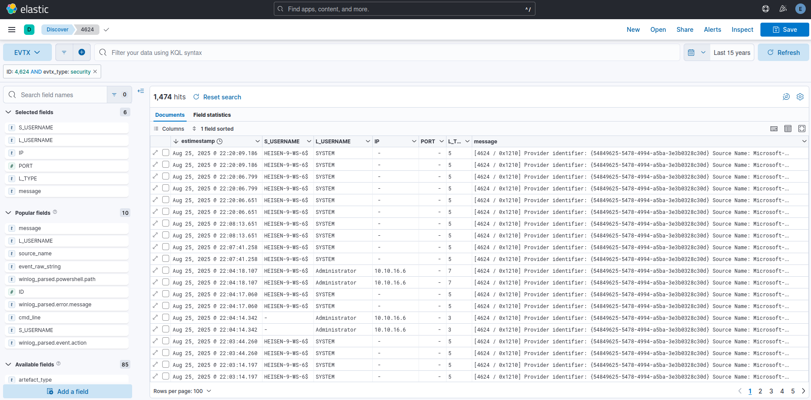

Plaso to ELK FORENSIC Ingestion Pipeline
===============================

This project provides a robust and modular ETL (Extract, Transform, Load) pipeline designed to ingest Plaso forensic
timelines (JSON Lines format) from WINDOWS  into an Elasticsearch (ELK) stack. It addresses common challenges in forensic data
ingestion such as timestamp normalization, mapping conflicts, and data volume handling.

Features
--------
- **Ready to Import DataViews**: for specific artefacts (EVTX, MFT, HIVES, etc, see exemples),

- **Modular Architecture:** Dedicated processors for various artifact types (EVTX, MFT, Registry, LNK, Prefetch, Browser
  History, etc.).

- **Timestamp Normalization:** Intelligently handles and converts various timestamp formats (FILETIME, Unix
  Microseconds, OLE Automation, WebKitTime) into a standardized ISO 8601 format compatible with Elasticsearch.

- **Data Denormalization:** Automatically expands complex artifacts like MRU lists, Registry values, and Prefetch mapped
  files into individual searchable documents.

- **Resilient Upload:** Supports both parallel and streaming upload modes with configurable timeouts and retry
  mechanisms to handle large datasets and network instability.

- **Mapping Conflict Prevention:** renames or converts problematic fields (like MFT file references) to ensure smooth
  indexing.

- **Consolidated Indices:** Groups related artifacts into broad indices (e.g., `_process`, `_files`, `_hive`, `_evtx`)
  while retaining granular artifact type identification.

Prerequisites
-------------

- **Python 3.7+**

- **Elasticsearch Cluster** (v7.x or v8.x recommended)

- **Plaso Timeline:** A timeline generated by `log2timeline.py` outputted in JSON Lines format (`.jsonl`).

Installation
------------

1. **Clone the repository:**

   ```
   git clone [https://github.com/yourusername/plaso-to-elk.git](https://github.com/yourusername/plaso-to-elk.git)
   cd plaso-to-elk

   ```

2. **Install dependencies:** It is recommended to use a virtual environment.

   ```
   pip install elasticsearch xmltodict

   ```

Usage
-----

The main entry point is `plaso_2_siem.py`.

### Basic Command

```
python3 plaso_2_siem.py\
  -t /path/to/your/timeline.jsonl\
  -c "CaseName"\
  -m "MachineName"\
  --es-hosts "https://localhost:9200"\
  --es-user "elastic"\
  --es-pass "changeme"

```

### Arguments Detail

Here is a comprehensive list of all available command-line arguments:

| Argument         | Short | Description                                                                                                                                                   | Default                  | Required |
|------------------|-------|---------------------------------------------------------------------------------------------------------------------------------------------------------------|--------------------------|----------|
| `--timeline`     | `-t`  | Path to the Plaso timeline file in JSON Lines (`.jsonl`) format.                                                                                              | None                     | **Yes**  |
| `--case-name`    | `-c`  | Name of the investigation case. Used as a prefix in index names (e.g., `plaso_CASENAME_...`). Sanitized to be lowercase and alphanumeric.                     | None                     | **Yes**  |
| `--machine-name` | `-m`  | Name of the machine or evidence source. Used in index names. Sanitized to be lowercase.                                                                       | None                     | **Yes**  |
| `--es-hosts`     | -     | Comma-separated list of Elasticsearch hosts (URLs).                                                                                                           | `https://localhost:9200` | No       |
| `--es-user`      | -     | Username for Elasticsearch authentication.                                                                                                                    | `elastic`                | No       |
| `--es-pass`      | -     | Password for Elasticsearch authentication.                                                                                                                    | `changeme`               | No       |
| `--chunk-size`   | -     | Number of documents to send in a single bulk request. Lower this value if you encounter timeout errors or 413 Payload Too Large.                              | `250`                    | No       |
| `--es-timeout`   | -     | Connection timeout in seconds for Elasticsearch requests. Increase this for heavy loads or slow networks.                                                     | `60`                     | No       |
| `--mode`         | -     | Upload mode strategy. Options: `parallel` (multi-threaded, faster) or `streaming` (sequential, lower memory usage).                                           | `parallel`               | No       |
| `--thread-count` | -     | Number of worker threads to use when mode is set to `parallel`.                                                                                               | `4`                      | No       |
| `--verify-ssl`   | -     | Enable SSL certificate verification. By default, self-signed certificates are accepted (verification disabled). Use this flag to enforce strict verification. | `False`                  | No       |

### Example with Optimized Settings

For a large timeline file on a machine with multiple cores:

```
python3 plaso_2_siem.py\
  -t large_timeline.jsonl\
  -c "Investigation_01"\
  -m "Server_01"\
  --chunk-size 500\
  --es-timeout 120\
  --mode parallel\
  --thread-count 8

```

For a low-resource environment or unstable connection:

```
python3 plaso_2_siem.py\
  -t timeline.jsonl\
  -c "Case_02"\
  -m "Laptop_B"\
  --chunk-size 100\
  --es-timeout 60\
  --mode streaming

```

Project Structure
-----------------

- **`plaso_2_siem.py`**: The main orchestrator. It reads the timeline, identifies artifacts via Regex, and routes them
  to the appropriate processor.

- **`elastic_uploader.py`**: Handles the connection to Elasticsearch, index template creation, and bulk data upload (
  streaming or parallel).

- **`plaso_processors/`**: Contains the logic for parsing and cleaning specific artifacts.

    - `base_processor.py`: Base class with common utility functions (timestamp parsing, field dropping).

    - `evtx_processor.py`: Parses Windows Event Logs (Security, System, PowerShell, WMI, etc.).

    - `registry_processor.py`, `runkey_processor.py`, `amcache_processor.py`: Handle Registry hives and specific keys.

    - `mft_processor.py`: Handles NTFS MFT entries.

    - `lnk_processor.py`: Handles LNK files and JumpLists.

    - `prefetch_processor.py`: Handles Prefetch files.

    - `browser_history_processor.py`: Handles web history (Chrome, Edge, Firefox).

    - `srum_processor.py`: Handles SRUM database entries.

    - `generic_processor.py`: Fallback for unhandled artifact types.

Indexing Strategy
-----------------

Data is routed to consolidated indices based on category to reduce index sprawl:

- `plaso_{case}_{machine}_evtx`: Windows Event Logs.

- `plaso_{case}_{machine}_hive`: Registry artifacts (Hives, RunKeys, USB, MRU).

- `plaso_{case}_{machine}_process`: Execution artifacts (Prefetch, Amcache, Shimcache, SRUM, UserAssist).

- `plaso_{case}_{machine}_files`: File system artifacts (MFT, LNK).

- `plaso_{case}_{machine}_browser_artefacts`: Web browser history.

- `plaso_{case}_{machine}_others`: Everything else.

You can filter specific artifacts within these indices using the `artefact_type` field (e.g.,
`artefact_type: "amcache"`).

DATAVIEWS EXEMPLES:
---------------

I've created dataviews to produce similar results to my other tools :
- [WAPP](https://github.com/youhgo/WFAPP)
- [MPP](https://github.com/youhgo/maximumPlasoTimelineParser)

The goal is to provide straight forward informations to see instantly the info you are looking for.

You can import all the provided dataview directly in kibana, in the saved object section just import the file : [all_view.ndjson](./kibana_view/all_view.ndjson)

Here is an exemple of 4624 user logon dataview :



Troubleshooting
---------------

- **Timeout Errors:** If you see `ReadTimeoutError`, try reducing `--chunk-size` (e.g., to 100) and increasing
  `--es-timeout`.

- **Mapping Errors:** The pipeline automatically handles known mapping conflicts (like MFT `file_reference`). If new
  ones appear, check the `_others` index for error messages.